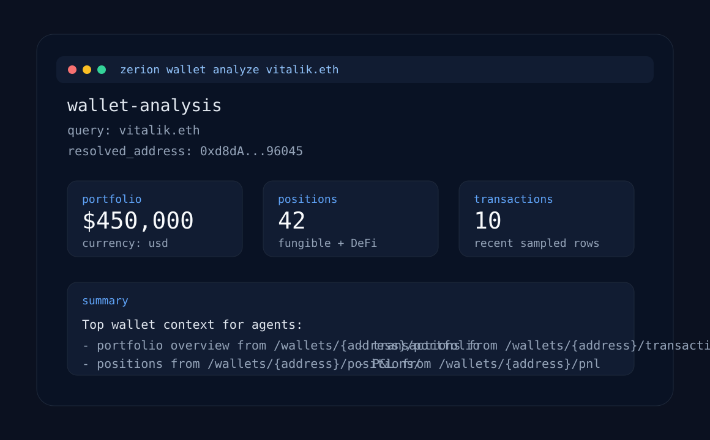

# @bundie/zerion-agent — Bundie x Zerion track integration

> **Forked from [`zeriontech/zerion-ai`](https://github.com/zeriontech/zerion-ai)
> at commit `376d30b` ("Merge pull request #14 from zeriontech/feat/mpp-payment").**
>
> Full credit to the Zerion team — this fork only adds a `src/bundie/` layer
> and a new `zerion-bundie` CLI binary on top of the upstream `zerion` CLI.
> Every modified file vs upstream is listed in [`docs/UPSTREAM_DIFF.md`](docs/UPSTREAM_DIFF.md)
> so future merges from upstream are mergeable.

## What this fork adds

A **policy-controlled Bundie strategy rebalancer** that routes swaps through
the Zerion API. A Bundie strategy creator (human or agent) declares a target
composition (e.g. `40% SOL / 30% USDC / 30% mSOL`) plus a `policies.yaml`,
and the agent monitors the strategy's wallet PDA and rebalances back to
target whenever drift exceeds a threshold — with every swap gated by a
**DENY-by-default** policy enforcer.

### The five scoped policies (Zerion track requirement)

| Policy            | Config                                                      | Behavior                                                          |
| ----------------- | ----------------------------------------------------------- | ----------------------------------------------------------------- |
| `chain_lock`      | `allowed_chains: [solana]`                                  | Reject swaps not on an allowed chain                              |
| `spend_limit`     | `max_notional_usd_per_rebalance`, `max_notional_usd_per_day`| Per-swap and rolling-24h USD caps                                 |
| `asset_whitelist` | `allowed_mints: [...]`                                      | Both sides of every swap must be in the allowed mint list         |
| `expiry`          | `max_age_days` (or `expires_at_ms`)                         | Agent stops auto-acting after N days unless re-armed              |
| `nav_divergence`  | `max_drop_pct`, `window_minutes`                            | Kill-switch — pause if NAV drops more than X% in Y minutes        |

DENY-by-default: a swap proceeds only if **every** enabled policy returns
`{ allow: true }`. Unknown policy IDs cause boot failure. Policies are loaded
from `policies.yaml` at agent start — never hardcoded.

### Where the real Zerion swap is executed

The agent's executor delegates to the upstream Zerion CLI's swap pipeline.
The actual on-chain transaction goes through:

- `cli/lib/trading/swap.js:120` — `executeSwap(quote, walletName, passphrase, opts)`
  - For Solana: routes to `cli/lib/chain/solana.js:26` — `signAndBroadcastSolana(...)`
    which signs via OWS and broadcasts via `web3.js sendAndConfirmRawTransaction`
    at `cli/lib/chain/solana.js:48`.
  - For EVM: routes through `cli/lib/trading/transaction.js` (`signSwapTransaction`
    + `broadcastAndWait`) called at `cli/lib/trading/swap.js:200`.

These call sites are unmodified vs upstream — the rebalancer composes them.

## Install

```bash
# from the Bundie monorepo root (this fork lives at packages/zerion-agent)
pnpm install --filter @bundie/zerion-agent
pnpm --filter @bundie/zerion-agent build         # syntax check (pure ESM, no compile)
pnpm --filter @bundie/zerion-agent test:bundie   # 36 tests for the new layer
```

## 5-step demo: `git clone` to a live policy-controlled rebalance loop

```bash
# 1. Clone Bundie + this fork (already nested under packages/zerion-agent)
git clone https://github.com/<your-org>/bundie-yields-v2.git
cd bundie-yields-v2

# 2. Install
pnpm install

# 3. Configure — set a target composition for your strategy
node packages/zerion-agent/src/cli.js target \
  --strategy Bun4tBew11dWjx1mRuMmJZFmxsGsxYSYhdfe1w7JaHVm \
  --nav-oracle <your-nav-oracle-pda> \
  --target-composition '{"So11111111111111111111111111111111111111112":40,"EPjFWdd5AufqSSqeM2qN1xzybapC8G4wEGGkZwyTDt1v":30,"mSoLzYCxHdYgdzU16g5QSh3i5K3z3KZK7ytfqcJm7So":30}'

# 4. Dry-run the policy-controlled loop (no Zerion API call, no on-chain tx)
node packages/zerion-agent/src/cli.js watch \
  --policies packages/zerion-agent/examples/bundie/policies.yaml \
  --interval 60000 \
  --dry-run

# 5. Inspect actions / decisions in logs/zerion-agent-<ts>.jsonl, then flip
#    on real execution by setting up a Zerion agent token and removing --dry-run
#    (see "Going live" below).
```

## CLI reference

```text
zerion-bundie target --strategy <pk> --nav-oracle <pk> --target-composition '<json>'
zerion-bundie watch  --policies policies.yaml [--interval ms] [--dry-run]
zerion-bundie status
zerion-bundie pause     # kill-switch
zerion-bundie resume
```

## Going live (what you need beyond this PoC)

This PoC is **dry-run safe by default**: in `--dry-run` the executor is mocked
so no Zerion API call and no on-chain transaction is made. To ship for real
you need:

1. **A Zerion API key** from <https://dashboard.zerion.io> — set
   `ZERION_API_KEY=zk_dev_...`. See [Zerion docs](https://developers.zerion.io/reference/getting-started)
   and [Build with AI](https://developers.zerion.io/reference/building-with-ai).
2. **An agent token + scoped wallet** — `zerion wallet create --name bundie-agent`
   then `zerion agent create-token --wallet bundie-agent` (see upstream
   [`cli/README.md`](cli/README.md)). The agent token is used as the OWS
   passphrase by `cli/lib/trading/guards.js:requireAgentToken`.
3. **A live balance provider** — replace `makeLiveBalanceProvider` in
   `src/cli.js` with a real SPL token-account scan against the strategy's
   wallet PDA, plus a USD price source (Zerion's Spot Price API works).
4. **USD→native amount conversion** — the proposal carries `notionalUsd`;
   wrap that with the spot-price lookup before calling the Zerion swap quote
   so `amount` matches the upstream `getSwapQuote` signature.
5. **Devnet caveats** — Zerion's swap routing currently targets mainnet.
   For devnet smoke testing you'll want to either point the loop at
   mainnet-beta or stub the executor (which is exactly what `--dry-run` does).
6. **Persistent runtime** — the in-memory `runtime` (spendLog, navHistory)
   is reset every CLI invocation; production deployments should persist it
   alongside `.zerion-bundie-state.json`.

## How the integration fits together

```
┌───────────────────────────────┐
│ src/cli.js  (zerion-bundie)   │   ← new CLI
└─────────────┬─────────────────┘
              │
              ▼
┌───────────────────────────────┐
│ src/bundie/rebalance-loop.js  │   ← orchestrates the tick
└─────┬──────────────┬──────────┘
      │              │
      ▼              ▼
┌──────────┐  ┌─────────────────┐    ┌─────────────────────────┐
│ policies │  │ strategy-       │    │ cli/lib/trading/swap.js │
│  .js +   │  │ monitor.js      │    │ executeSwap (line 120)  │  ← UPSTREAM, unchanged
│ loader   │  │ (devnet RPC)    │    └────────────┬────────────┘
└──────────┘  └─────────────────┘                 │
                                                  ▼
                                  cli/lib/chain/solana.js:26
                                  signAndBroadcastSolana
                                                  │
                                                  ▼
                                  web3.js sendAndConfirmRawTransaction (line 48)
```

## Tests

```bash
pnpm --filter @bundie/zerion-agent test:bundie   # 36 Bundie tests
pnpm --filter @bundie/zerion-agent test          # all (228 incl. upstream)
```

The Bundie suite asserts each policy's decision boundary plus three
mandatory end-to-end assertions:

- when composition drifts > 5%, the policy-enforced swap params are computed correctly
- when `spend_limit` denies the swap, **no Zerion API call is attempted**
- when `expiry` has elapsed, **no Zerion API call is attempted**

See `tests/unit/bundie-*.test.mjs`.

## Files added by this fork

```
src/cli.js                              # zerion-bundie CLI entry point
src/bundie/policies.js                  # 5 scoped policies + PolicyEnforcer
src/bundie/policy-loader.js             # YAML/JSON policy loader
src/bundie/strategy-monitor.js          # devnet Strategy + NavOracle reader
src/bundie/rebalance-loop.js            # tick / startLoop with mockable deps
src/bundie/state-store.js               # tiny per-CLI-invocation JSON store
examples/bundie/policies.yaml           # example policy file
tests/unit/bundie-policies.test.mjs     # decision-boundary tests
tests/unit/bundie-rebalance.test.mjs    # end-to-end assertions w/ mocks
tests/unit/bundie-policy-loader.test.mjs# loader tests
docs/UPSTREAM_DIFF.md                   # what we changed vs upstream
```

## Files modified vs upstream

Only two upstream files were touched — see [`docs/UPSTREAM_DIFF.md`](docs/UPSTREAM_DIFF.md)
for the exact diffs. All policy / monitor / loop logic lives in `src/bundie/`,
which is purely additive.

---

# Original `zerion-ai` README (upstream, unmodified below)

---

# zerion-ai

**Maintained by Zerion.**

`zerion-ai` is the public, self-contained repo for using Zerion from AI agents and developer tools.

It packages two first-class integration paths:

- **Hosted MCP** for Cursor, Claude, and other MCP-native agent environments
- **`zerion`** for OpenClaw-like and command-based agent runtimes

It ships two flagship workflows:

- **`wallet-analysis`** — portfolio, positions, transactions, and PnL analysis (agent operation)
- **`wallet-trading`** — swap, bridge, buy/sell tokens (agent operation); wallet setup, agent tokens, and policies (manual, requires passphrase)



## 1. Choose your authentication method

### Option A: API Key

Get an API key and export it: [Get your API key](https://dashboard.zerion.io)

```bash
export ZERION_API_KEY="zk_dev_..."
```

- API auth via **HTTP Basic Auth**
- dev keys beginning with `zk_dev_`
- current dev-key limits of **120 requests/minute** and **5k requests/day**

Useful docs:

- [Build with AI](https://developers.zerion.io/reference/building-with-ai)
- [Get Wallet Data With Zerion API](https://developers.zerion.io/reference/getting-started)

### Option B: x402 Pay-per-call

**No API key needed.** Pay $0.01 USDC per request via the [x402 protocol](https://www.x402.org/). Supports EVM (Base) and Solana. The CLI handles the payment handshake automatically.

> Pay-per-call applies to analytics commands only (`portfolio`, `positions`, `history`, `pnl`, `analyze`). Trading commands (`swap`, `send`, `bridge`, `search`, …) always use an API key, even when `ZERION_X402` is set globally. The `chains` command runs fully offline (local registry) and needs no auth at all.

**Single key** — format is auto-detected:

```bash
export WALLET_PRIVATE_KEY="0x..."    # EVM (Base) — 0x-prefixed hex
export WALLET_PRIVATE_KEY="5C1y..."  # Solana — base58 encoded keypair
```

**Both chains simultaneously:**

```bash
export EVM_PRIVATE_KEY="0x..."
export SOLANA_PRIVATE_KEY="5C1y..."
export ZERION_X402_PREFER_SOLANA=true  # optional: prefer Solana when both are set
```

Then use the `--x402` flag:

```bash
zerion wallet analyze 0xd8dA6BF26964aF9D7eEd9e03E53415D37aA96045 --x402
```

Or enable x402 globally:

```bash
export ZERION_X402=true
zerion wallet analyze 0xd8dA6BF26964aF9D7eEd9e03E53415D37aA96045
```

### Option C: MPP Pay-per-call

**No API key needed.** Pay $0.01 USDC per request via the [MPP protocol](https://mpp.dev) on [Tempo](https://tempo.xyz). The CLI handles the payment handshake automatically.

> Like Option B, pay-per-call applies only to analytics commands. Trading commands always use an API key.

```bash
export WALLET_PRIVATE_KEY="0x..."   # EVM private key with USDC on Tempo
```

Or use a dedicated key:

```bash
export TEMPO_PRIVATE_KEY="0x..."
```

Then use the `--mpp` flag:

```bash
zerion portfolio 0xd8dA6BF26964aF9D7eEd9e03E53415D37aA96045 --mpp
```

Or enable MPP globally:

```bash
export ZERION_MPP=true
zerion portfolio 0xd8dA6BF26964aF9D7eEd9e03E53415D37aA96045
```

## 2. Install skills (Claude Code, Cursor, OpenClaw)

```bash
npx skills add zeriontech/zerion-ai
```

This installs 4 skills into your agent:

| Skill | Description |
|-------|-------------|
| **wallet-analysis** | Analyze wallets: portfolio, positions, transactions, PnL |
| **wallet-trading** | Swap, bridge, buy/sell tokens, wallets, agent tokens, policies |
| **chains** | List supported blockchain networks |
| **zerion** | CLI setup, authentication, and troubleshooting |

The skills reference `zerion` which runs via `npx zerion` (no global install needed).

## 3. Choose your integration path

### MCP clients

Use this if your agent runtime already supports MCP.

Start here:

- [Hosted MCP quickstart](./mcp/README.md)
- [Cursor example](./examples/cursor/README.md)
- [Claude example](./examples/claude/README.md)

### OpenClaw and CLI-based agents

Use this if your framework models tools as shell commands returning JSON.

```bash
npm install -g zerion
zerion wallet analyze 0xd8dA6BF26964aF9D7eEd9e03E53415D37aA96045
```

Start here:

- [OpenClaw example](./examples/openclaw/README.md)
- [CLI usage](./cli/README.md)

## 4. Run the first wallet analysis

### MCP quickstart

1. Export your API key:

   ```bash
   export ZERION_API_KEY="zk_dev_..."
   ```

2. Add the hosted Zerion MCP config from [examples/cursor/mcp.json](./examples/cursor/mcp.json) or [examples/claude/mcp.json](./examples/claude/mcp.json)
3. Ask:

   ```text
   Analyze the wallet 0xd8dA6BF26964aF9D7eEd9e03E53415D37aA96045.
   Summarize total portfolio value, top positions, recent transactions, and PnL.
   ```

### CLI quickstart

**With API key:**

```bash
npm install -g zerion
export ZERION_API_KEY="zk_dev_..."
zerion wallet analyze 0xd8dA6BF26964aF9D7eEd9e03E53415D37aA96045
```

**With x402 (no API key needed):**

```bash
npm install -g zerion
export WALLET_PRIVATE_KEY="0x..."   # or base58 for Solana
zerion wallet analyze 0xd8dA6BF26964aF9D7eEd9e03E53415D37aA96045 --x402
```

Example output:

```json
{
  "wallet": {
    "query": "0xd8dA6BF26964aF9D7eEd9e03E53415D37aA96045"
  },
  "portfolio": {
    "total": 450000,
    "currency": "usd"
  },
  "positions": {
    "count": 42
  },
  "transactions": {
    "sampled": 10
  },
  "pnl": {
    "available": true
  }
}
```

## Example wallets

This repo uses the same public wallets across examples:

- `vitalik.eth` / `0xd8dA6BF26964aF9D7eEd9e03E53415D37aA96045`
- ENS DAO treasury / `0xFe89Cc7Abb2C4183683Ab71653c4cCd1b9cC194e`
- Aave collector / `0x25F2226B597E8F9514B3F68F00F494CF4F286491`

## What ships in this repo

- [`skills/`](./skills/): 4 agent skills installable via `npx skills add zeriontech/zerion-ai`
  - [`wallet-analysis/`](./skills/wallet-analysis/SKILL.md): portfolio, positions, transactions, and PnL analysis
  - [`wallet-trading/`](./skills/wallet-trading/SKILL.md): swap, bridge, buy/sell, wallets, agent tokens, policies
  - [`chains/`](./skills/chains/SKILL.md): supported blockchain networks reference
  - [`zerion/`](./skills/zerion/SKILL.md): CLI setup, auth, and troubleshooting
- [`mcp/`](./mcp/README.md): hosted Zerion MCP setup plus the tool catalog
- [`cli/`](./cli/): `zerion` unified CLI — wallet analysis + trading (published to npm)
- [`examples/`](./examples/): Cursor, Claude, OpenAI Agents SDK, raw HTTP, and OpenClaw setups

## Failure modes to expect

Both the MCP and CLI surfaces should handle:

- missing or invalid API key
- invalid wallet address
- unsupported chain filter
- empty wallets / no positions
- rate limits (`429`)
- upstream timeout or temporary unavailability

See [mcp/README.md](./mcp/README.md) and [cli/README.md](./cli/README.md) for the concrete behavior used in this repo.
